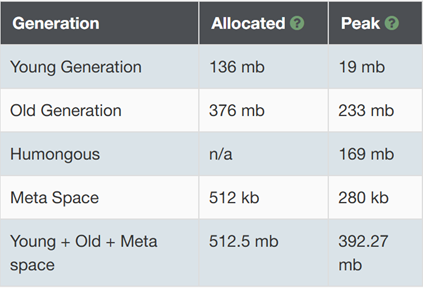
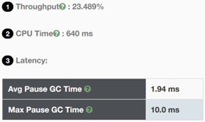
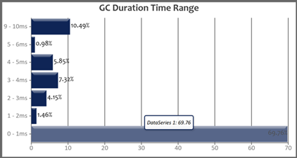
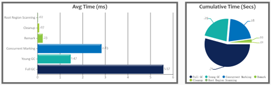

# G1 GC报告文档

## G1 垃圾回收介绍

G1垃圾回收器是一款面向服务端应用的垃圾收集器，其使命在于未来替换掉CMS垃圾回收器。其特点有：

- ①并行与并发：充分利用多CPU、多核环境下的硬件又是来缩短垃圾回收停顿时间，使垃圾回收与用户程序并发执行。
- ②分代收集：不需要与其他垃圾收集器配合就能独立管理整个GC堆，采用不同方式处理不同时期的对象。
- ③空间整合：从整体上看是基于标记-整理算法实现的垃圾回收器；从局部上看是基于复制算法实现的。这意味着G1运行期间不会产生内存空间碎片。
  -④可预测的停顿：除了追求低停顿外，G1还能建立可预测的停顿时间模型，可以明确指定M毫秒时间片内，垃圾回收消耗的时间不超过N毫秒。

G1垃圾回收器的内存布局和其他回收器有很大差别，它将整个Java堆划分为多个大小相等的区域Region，虽然保留了新生代和老年代的概念，但是不再是物理隔离的，它们都是一部分Region的集合（不需要连续）。

G1垃圾回收器之所以能够建立可预测的停顿时间模型，是因为它可以有计划地避免在整个Java堆中进行全区域的垃圾回收。G1会跟踪每个Region里垃圾堆积的价值大小（回收可获得的空间与回收所需时间的经验值），并维护一个优先列表，每次根据允许的收集时间来优先回收价值最大的Region。这种以Region划分内存空间以及有优先级的区域回收方式，保证了G1回收器在有限的时间内可以获取尽可能高的收集效率。

对于不同Region之间的对象引用（类似于其他回收器中新生代和老年代间的对象引用），虚拟机都是使用Remember Set来避免全堆扫描的，当程序对Reference类型的数据进行写操作时，相关信息会被记录到被引用对象所属Region的Remember Set中，当垃圾回收时，在GC根节点加入Remember Set即可保证不对全堆进行扫描。

在不计算维护Remember Set的操作时，G1回收器的运作大致可以划分为：

- ①初始标记，标记GC Roots能直接关联的对象
- ②并发标记，从GC Roots开始对堆中的对象进行可达性分析，找出存货的对象。这一阶段与用户程序并发执行。
- ③最终标记，修正因用户程序继续运作而导致标记产生变动的那一部分标记记录，虚拟机将这段时间的对象变化记录在线程Remember Set Logs中，最终标记阶段需要将Remember Set Logs中的数据合并到Remember Set中，这部分需要停顿线程，但是可以并发执行。
- ④筛选回收，对各个Region的回收价值和成本进行排序，根据用户期望的GC停顿时间来制定回收计划。

## 模拟内存分配与垃圾回收的程序

### 导入所需的包

```
import java.util.Random;
import java.util.concurrent.TimeUnit;
import java.util.concurrent.atomic.LongAdder;

```

### 随机生成对象的函数

```
private static Object generateGarbage(int max) {
    int randomSize = random.nextInt(max);
    int type = randomSize % 4;
    Object result = null;
    switch (type) {
        case 0:
            result = new int[randomSize]; break;
        case 1:
            result = new byte[randomSize]; break;
        case 2:
            result = new double[randomSize]; break;
        default:
            StringBuilder builder = new StringBuilder();
            String randomString = "randomString-Anything";
            while (builder.length() < randomSize) {
                builder.append(randomString);
                builder.append(max);
                builder.append(randomSize);
            }
            result = builder.toString();
            break;
    }
    return result;
}

```

### 主要执行流程

```
public class TestGC {
    private static Random random = new Random();
    public static void main(String[] args) {
        long startMillis = System.currentTimeMillis();
        long timeoutMillis = TimeUnit.SECONDS.toMillis(1);
        long endMillis = startMillis + timeoutMillis;
        LongAdder counter = new LongAdder();
        System.out.println("正在执行...");
        // 缓存一部分对象; 进入老年代
        int cacheSize = 2000;
        Object[] cachedGarbage = new Object[cacheSize];
        // 在此时间范围内,持续循环
        while (System.currentTimeMillis() < endMillis) {
            // 生成垃圾对象
            Object garbage = generateGarbage(100*1024);
            counter.increment();
            int randomIndex = random.nextInt(2 * cacheSize);
            if (randomIndex < cacheSize) {
                cachedGarbage[randomIndex] = garbage;
            }

            //执行System.gc()来鼓励G1 GC进行mixed collection
            if(counter.longValue() % 100 == 0){
                System.gc();
            }
        }

        System.out.println("执行结束!共生成对象次数:" + counter.longValue());
    }
}

```

## 运行参数与GC日志分析

### 运行参数

```
java -XX:+UseG1GC -Xms512m -Xmx512m -Xlog:gc*:file=gc.log:time,level,tags TestGC
```

### GC日志内容

部分GC日志内容如下所示：

```
[info][gc,task        ] GC(10) Using 12 workers of 13 for full compaction
[info][gc,start       ] GC(10) Pause Full (System.gc())
[info][gc,phases,start] GC(10) Phase 1: Mark live objects
[info][gc,phases      ] GC(10) Phase 1: Mark live objects 0.380ms
[info][gc,phases,start] GC(10) Phase 2: Prepare for compaction
[info][gc,phases      ] GC(10) Phase 2: Prepare for compaction 0.107ms
[info][gc,phases,start] GC(10) Phase 3: Adjust pointers
[info][gc,phases      ] GC(10) Phase 3: Adjust pointers 0.154ms
[info][gc,phases,start] GC(10) Phase 4: Compact heap
[info][gc,phases      ] GC(10) Phase 4: Compact heap 0.711ms
[info][gc,heap        ] GC(10) Eden regions: 15->0(25)
[info][gc,heap        ] GC(10) Survivor regions: 0->0(0)
[info][gc,heap        ] GC(10) Old regions: 55->59
[info][gc,heap        ] GC(10) Archive regions: 0->0
[info][gc,heap        ] GC(10) Humongous regions: 55->46
[info][gc,metaspace   ] GC(10) Metaspace: 197K(384K)->197K(384K) NonClass: 190K(256K)->190K(256K) Class: 7K(128K)->7K(128K)
[info][gc             ] GC(10) Pause Full (System.gc()) 116M->98M(512M) 1.922ms
[info][gc,cpu         ] GC(10) User=0.00s Sys=0.00s Real=0.00s
```

### GC日志解析

测试代码一共生成了12000个对象，整个GC日志超过6千行，所以此处使用GCEasy工具堆日志进行分析。

#### 1)内存空间分配与使用情况



在G1这种内存回收策略下，不像传统的垃圾回收器那样严格区分新生代和老年代，而是根据需求和实时垃圾情况动态调整内存的使用和回收策略。因此，此处的新生代老年代分配空间136Mb和376Mb仅供参考，总的堆内存空间分配为512Mb。

此外，G1 GC还定义了一种Humongous空间，专门用来存储大对象（超过Region容量一半的对象即为大对象），超过整个Region区域的会存放在多个连续的Humongous区中，在G1这种策略下，Humongous被视作老年代的一部分，从日志分析中可以看出，这部分区域峰值大小为169Mb。

垃圾回收策略不仅会对Java堆空间进行回收，还会对方法区进行管理，表中的Meta Space就是用来存储类的结构信息、常量池、静态变量等数据的区域，大小根据应用程序的需求和本地内存的可用性动态确定，此处分配大小为512Kb。该区域不作为此处GC日志分析的重点，仅在此处稍作解释。

#### 2)关键性能指标



G1 GC在上述实验程序中的各项重要性能指标如上图所示。

首先，吞吐量Throughput通过计算处理真正程序业务所耗时间与垃圾回收使用时间的比值来确定，吞吐量的值越大通常来说越好，然而此处G1回收策略的吞吐量仅为23.489%。这是因为G1回收策略设计时并非以最大化吞吐量为首要目标。吞吐量较低的原因主要有以下几点：

- 1> 多区域管理和回收策略：G1回收策略将内存划分为多个Region，采用分代收集的思想。其试图通过动态地优化每个Region的回收策略，来减少长时间的停顿，这种精细化的管理会带来额外的开销。

- 2> 混合回收：G1引入了Mixed GC的概念，即在全堆回收(Full GC)时，同时清理年轻代和部分老年代的区域，这种策略虽然能减少全堆回收的停顿时间，但在选择部分老年代时会引入额外的成本。

其次，垃圾回收的CPU消耗时间为640ms，相比于Parallel GC，其CPU消耗时间在相同程序下，是2 sec 120 ms，G1 GC的优势显著。

而后，延迟Latency的情况，平均的Stop The World(STW)的延迟时间为1.94ms，最大STW的延迟时间为10ms。相比于Parallel GC达到7.61ms的平均延迟时间和30ms的最大延迟时间来说，G1 GC的提高非常显著。



从上图可以看出，大部分的CPU延迟时间都集中在1ms的范围内，说明G1这种策略的特点就是尽可能地在给其设定的延迟目标下达到尽可能高的吞吐量，与以往追求一次将整个Java堆全部清理干净的回收机制不同。我们也可以通过指定参数的方式，指定希望满足的延迟时间需求。

最后，是各种过程的时间开销统计。



上图中是G1各个阶段的平均时间开销和总计时间开销。

- 根区域扫描，是指垃圾回收的开始阶段，回收器扫描一些特定的区域，包含从Java线程栈、静态对象等出发的扫描，目的是确定哪些对象当前仍然是活跃的，此部分时间占比极少。

- 并发标记Concurrent Marking，这一阶段是与应用程序同时进行的，G1会使用多个GC线程来遍历整个堆中的对象图，并标记所有从根对象可以直接或间接访问到的活跃对象。这个阶段的目的是尽可能快速地识别哪些对象是存活的，以便后续垃圾回收阶段处理未使用对象，这一阶段时间占比较高，是G1回收的关键。

- 重标记Remark，这一阶段是为了捕获一些对象在标记开始后被创建或修改，这个阶段会在STW情况下进行，以确保所有活跃对象都得到正确标记，因为其需要STW，所以其时间开销相对不长。

- Cleanup清理，在Remark阶段后，G1会清理并回收那些被标记为垃圾的对象所占的内存空间，还包括对空闲区域的整理，以便为将来的对象分配做准备。

- Young GC年轻代GC，只清理年轻代的Eden区和Survivor区，主要目的是尽早清理掉那些短期存活的对象，减少它们进入老年代的机会，从而延缓老年代的Full GC发生。

- 全堆GC Full GC，尽管G1已经尽可能想减少Full GC的发生，但有时仍然需要进行全堆的垃圾回收，而G1 GC中，并不像传统的回收方式那样简单地在全堆上进行回收，而是采用Mixed GC的方式，根据global concurrent marking统计得出收益最高的若干old区中的Region，在用户指定的开销目标范围内尽可能地选择收益高的old区Region。当然，如果Mixed GC无法跟上程序分配内存的速度，导致Old区填满无法分配时，JVM会切换到G1之外的Serial Old GC来收集整个Java堆，上图中大量的Full GC开销可能存在这种切换的情况，所以Full GC的时间相对于其他开销来说要长很多。

## 通过修改JVM参数达成较小GC延迟

通过设置参数的方式，可以实现一些特定的目标，比如较小的GC延迟。


通过设置以下参数，在同样的代码下，能够将用于垃圾回收的CPU时间缩短20ms。

```
java -XX:+UseG1GC -XX:G1HeapRegionSize=1m -XX:MaxGCPauseMillis =100 -Xms512m -Xmx512m -Xlog:gc*:file=G1MaxMillsSetGC.log:time,level,tags TestGC
```

在这个参数中，通过设置Region的大小为1m，以及设定期望的预期停顿时间为100ms，能够将原本的总共回收开销CPU的640ms降低至620ms，平均回收时间和最大回收时间基本不变。

但需要注意的是，不能将-XX:MaxGCPauseMillis设置的太低，设置的太低会导致G1垃圾回收跟不上对象的分配，导致垃圾堆积，最终引发Full GC。
